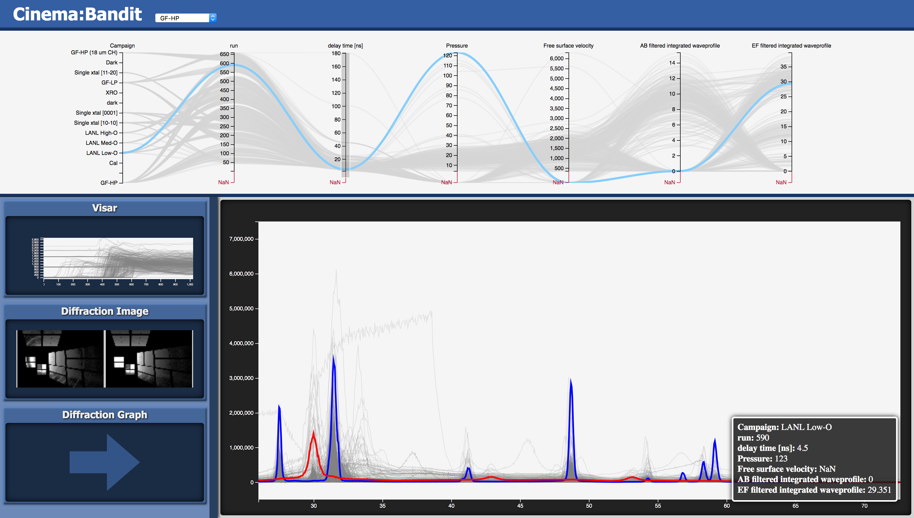

# BANDIT
## Version 1.1

</img>

A multi-view application for analysis and visualization of experimental data

### See databases.json for a template on adding new data

## Usage
* Select the dataset you wish to load in the drop-down menu in the header. (The first option will be loaded by default)
* The top part of the page contains a parallel coordinates chart displaying all the data points and their parameters. Filter the selection of data points by click-and-dragging a selection along one or more of the axes.
* The chart can be resized vertically by click-and-dragging the bar beneath it.
* The bottom part of the page contains the main view (on the right) and the sidebar (on the left). The sidebar displays the three available views, while the selected view is shown in the main view. Click a view in the sidebar to bring it into main view.
* With the Line Chart or Image views active, select the Zoom/Pan tool and scroll on the viewport to zoom in on the data. Click-and-drag to pan.
* Select the Erase tool and click-and-drag over data points to grey them out.
* Select the include tool and click-and-drag over erased data points to highlight them again.
* With the Zoom/Pan tool selected, click on a data point to select it. This selection will persist even when mousing over other points or off the graph. Click on another data point to change the selection or click in a blank spot on the graph to clear it.
* With the Image view active, scroll over one of the images to zoom on both of them. Click-and-drag to pan.

## How to Build and Install
* Build the external cinema components:
  ```
  make
  ```
* Install the application to a project location (default install path is build/install):
  ```
  make install INSTALL_PREFIX=/path/to/project_directory
  ```

## Formatting Data for Bandit
* Data for Bandit is a SpecD Cinema Database with some added dimensions used to load data into the viewer.

### Dimensions regarding data
There are two types of files that can be loaded in Bandit, time series data (.csv or .txt) and images (.png, .jpg, .gif, etc...). Please refer to the example [data.csv](https://github.com/cinemascience/cinema_bandit/blob/master/examples/sphere_multi-image.cdb/data.csv).  Simply add the file column according to Cinema SpecD with the name and number: FILE_\<display name\>_\<index\>.  By default if the file is a text file, it will use the first column as the x value and the second column as the y value.  This can be overridden in [databases.json](https://github.com/cinemascience/cinema_bandit/blob/master/databases.json) if desired.  If the files are the same for the same display name, it will only load the y value from the column index.

## Issues
* On Safari, the browser may reach a limit for files opened (Safari does not release files from file:// requests until the page is closed) and refuse to load more data when loading particularly large data sets.

## Changelog
### Version 1.1
 * Significant performance improvements. Data is gradually streamed in while it loads/draws so more hangups
 * Generalized data-loading. Can now view any properly-formatted dataset.
### Version 1.0
 * Initial Release
